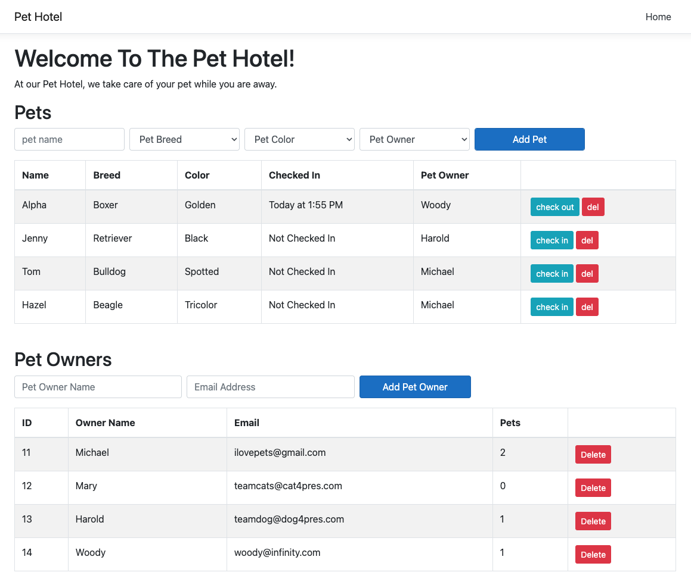

    
    
# Pet Hotel

## Table of Contents

- [Pet Hotel](#pet-hotel)
  - [Table of Contents](#table-of-contents)
  - [Description](#description)
  - [Screenshots](#screenshots)
  - [Built With](#built-with)
  - [Getting Started](#getting-started)
    - [Prerequisites](#prerequisites)
    - [Installation](#installation)
  - [Usage](#usage)
  - [License](#license)
  - [Acknowledgements](#acknowledgements)
  - [Contacts](#contacts)

## Description

Pet Hotel was a group project utilizing React.js as a front-end framework and C# and .NET as the back-end framework. The application is built to allow for the creation of pet owners, pets, and allow the pet to check-in and check-out of the Pet-Hotel. 

## Screenshots

## Built With

## Getting Started

To observe the functionalities of this application, the user will also need to fork, clone and install the front-end framework of this application. This repository only consist of the back-end framework. The front-end framework repository can be found at [Pet Hotel Frontend](https://github.com/chaochingvang/Pet-Hotel-Frontend/).

### Prerequisites

Softwares used in creating this application includes:

- [Visual Studio Code](https://code.visualstudio.com/)
- [PostgreSQL](https://www.postgresql.org/)
- [Postico](https://eggerapps.at/postico/)
- [Node.js](https://nodejs.org/en/)
- [Nodemon](https://nodemon.io/)
- [.NET](https://dotnet.microsoft.com/en-us/)

The application's repository may require alterations to lines of codes if used with other softwares that are not listed above.

### Installation

1. To run this application, the user should fork the repository onto their own GitHub account. In the user's repository, the user should copy the link and clone the repository onto their local system. Navigate to the repository folder using the terminal and run command line `npm install`
   - `$ cd ../Pet-Hotel-Backend`
   - `$ npm install`

2. Create a local postgreSQL database called `pet_hotel` with Postico using the command lines from the database.sql file. Using different database systems may require the user to alter or add additional command lines to reflect the example database provided.

3. To start up the application, enter in the terminal the command lines of:

   - `dotnet run` in the `Pet-Hotel-Backend` terminal to start the server
   - `npm start` in the `Pet-Hotel-Frontend` terminal to start the client

   The server should be running on `http://localhost:5000` whereas the client should be on `http://localhost:3000`. Both the server and the client is required to be up and running for the application to run successfully.

## Usage

Once the application is up and running, the user should be redirected to the browser with the application loaded. If not, open up a browser and enter in the url:

- `http://localhost:3000`

On the application, the user can create an Owner using the interface on the browser. Upon creating a pet owner, the user can now create a pet using the different types of selections in the dropdown menu and the owner it belongs to. The user can delete the pet. Multiple owners and pet can be created. 

Clicking 'Check In' will check in the pet to the Pet Hotel and show the time that it was checked in. Once the user want to 'Check Out' the pet, the user can click the button and it will check out the pet from the Pet Hotel. 

## License

<a href="https://choosealicense.com/licenses/unlicense/">The Unlicense</a>

## Acknowledgements

I would like to extend a thanks to our instructors, Dane Smith and Liz Kerber, the Solinas Cohort, and the whole greater community at Prime Digital Academy, for providing me with the necessary tools and skills to succeed.

I also would like to thank our friends and families for continuing to support me as I've continued to grow into becoming a software developer.

## Contacts

Chaoching Vang 
  